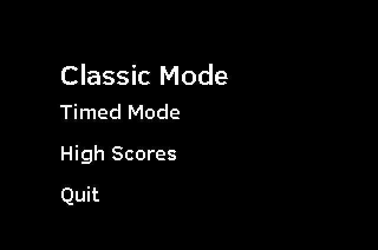
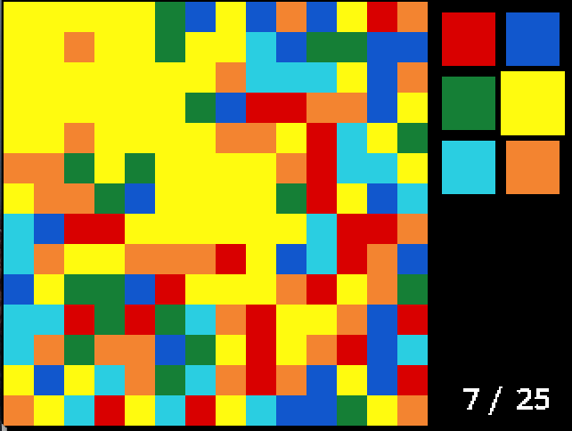
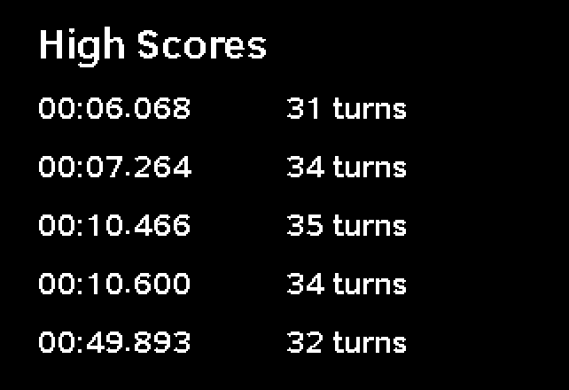

# Floodit

## Screenshots





## Dependancies

Requires:

* SDL2
* SDL2_ttf
* SDL2_net
* SDL2_image

## Compilation

	make

To compile for the GCW-zero, you need the toolchain (downloadable from the
console's website), then:

	make gcw CROSS_COMPILE=/opt/gcw0-toolchain/usr/bin/mipsel-linux-

To package for the gcw zero, you will need the package squashfs-tools, then run

	make opk

Finally, to use your opk, copy it in your GCW-Zero. I use scp for that, but via
ftp or on a memory card should work as well:

	scp floodit.opk root@[gcwIp]:/media/data/apps/

## How to play

To start the game, run the executable ```floodit```.

### PC controls

* arrows to navigate in the menus and in the colors (while in game)
* space to select a menu action or to select a color
* escape to go back

### GCW-Zero controls

* D-Pad to navigate in the menus and in the colors (while in game)
* A to select a menu action or to select a color
* select to go back

## Credits

Font ClearSans from
https://01.org/clear-sans/blogs/2013/clear-sans-new-font-optimized-small-screen-readability
